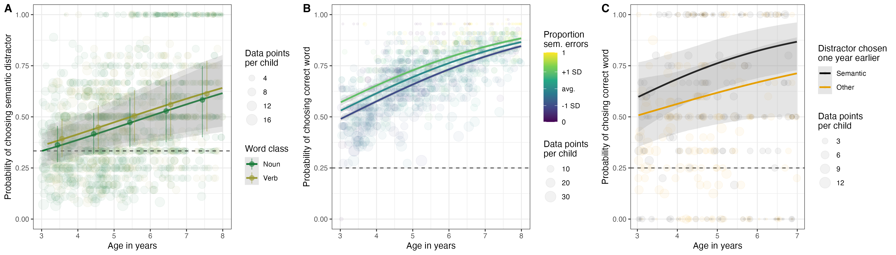

```{r setup, include = FALSE}
library("papaja")
r_refs("r-references.bib")
library(tidyverse)
```

```{r analysis-preferences}
# Seed for random number generation
set.seed(42)
knitr::opts_chunk$set(cache.extra = knitr::rand_seed)
```

Language learning involves learning how words refer to concepts, but also how concepts are organized in rich, structured semantic networks [@wojcik2018development; @unger2021emergence]. The emerging structure is not a mere by-product of learning 1:1 mappings, but influences the sequence in which words are learned. On this view, words form variable connections with other words, and the strength and structure of these connections determines which words are learned [@hills2009longitudinal]. Yet, this research has largely taken a word-level perspective, that is, network structures are built based on data -- for example, similarity ratings [@mcrae2005semantic] -- aggregated across individuals. Whether or not these networks reflect those learned by children, and how they influence language learning on an individual level, is not well understood. The present study addresses this gap.

One way to study semantic networks is through children’s errors. In picture naming and comprehension tasks, children often select or produce semantically related words instead of unrelated alternatives [@altman2017quantitative]. Such semantic errors are common in both monolingual and bilingual children [@krysztofiak2025searching] and become more frequent across the preschool years [@masterson2008object]. Previous work further shows that hearing a word activates related concepts even in infancy [@arias2009lexical] and that toddlers attend to semantically related referents when the target word is not yet fully known [@wojcik2018development]. These findings suggest that children can possess partial semantic knowledge before establishing stable word–referent mappings.

What remains unclear is whether semantic errors reflect incomplete knowledge or whether they index representations that support later learning. If children first learn broad conceptual structure and only later narrow meanings to narrowly defined concepts, then semantic errors should predict future acquisition. A child who selects a semantically related distractor may not know the target word precisely, but may already represent its conceptual domain.

The present study tested this idea using a combination of large cross-sectional and longitudinal datasets from preschool children completing a receptive vocabulary task. On each trial, children heard a noun or verb and selected one of several pictures, including a semantic distractor. This allowed us to examine both the developmental trajectory of semantic errors and their relation to later learning. 

# Results

```{r}
d_cross <- read_csv("../data/data_cross.csv")
d_long <- read_csv("../data/data_long.csv")

m_cross_age <- readRDS("../saves/cross_age.rds")%>%mutate_if(is.numeric, round, 2)%>%mutate_if(is.numeric, format, nsmall = 2)
m_cross_pred <- readRDS("../saves/cross_pred.rds")%>%mutate_if(is.numeric, round, 2)%>%mutate_if(is.numeric, format, nsmall = 2)
m_long_pred <- readRDS("../saves/long_pred.rds")%>%mutate_if(is.numeric, round, 2)%>%mutate_if(is.numeric, format, nsmall = 2)
```

```{r fig1, include = T, fig.cap = "Cross-sectional and longitudinal. links between semantic errors and vocabulary. A) Developmental trajectory for the probability to make a semantic error. Color shows word class (noun or verb). Lines show continous model predictions and points with error bars show model predictions for each age bin of one year. B) Predicted probability of choosing a correct word in the task by the proportion of semantic errors made. Lines show model predictions for different levels of the continous predictor. C) Probability of choosing a correct word conditional on the type of error made one year earlier. Lines show model predictions. Color shows error type (semantic or other). In all panels: error bands and bars show 95% credible intervals, transparent dots shows aggregated data for each child with size proportional to the number of trials.", out.width="100%"}

```

Based on a large sample (N = `r n_distinct(d_cross$subjID)`) of cross-sectional data from preschool children ($m_{age}$ = `r round(mean(d_cross%>%distinct(subjID, .keep_all = T)%>%pull(age)),2)`; range = `r round(min(d_cross%>%distinct(subjID, .keep_all = T)%>%pull(age)),2)` to `r round(max(d_cross%>%distinct(subjID, .keep_all = T)%>%pull(age)),2)`), we first showed that the proportion of semantic -- compared to other -- errors increased with age (estimate for age in a Bayesian GLMM: $\beta$ = `r m_cross_age%>%filter(param == "z_age")%>%pull(Estimate)`; 95% Credible Interval (CRI) [`r m_cross_age%>%filter(param == "z_age")%>%pull(Q2.5)` - `r m_cross_age%>%filter(param == "z_age")%>%pull(Q97.5)`]) and became dominant around 4.5 years of age (see Fig. \@ref(fig:fig1)A). This effect was robust across word classes, with no difference between nouns and verbs (estimate for verbs: $\beta$ = `r m_cross_age%>%filter(param == "word_classverb")%>%pull(Estimate)`; 95% CRI [`r m_cross_age%>%filter(param == "word_classverb")%>%pull(Q2.5)` - `r m_cross_age%>%filter(param == "word_classverb")%>%pull(Q97.5)`]). This finding replicates earlier work and shows that children's errors become more and more systematic as their mental lexicon grows [@masterson2008object].

However, this finding does not speak to whether systematic semantic errors also reflect advanced vocabulary knowledge. If systematic semantic errors are evidence for a larger and better connected mental lexicon, then children who make -- proportionally -- more semantic errors, should perform better in the task overall. We found clear evidence for this relationship: when predicting task performance by error type, we found children with a higher proportion of semantic errors to be more likely to choose a correct word (estimate for proportion of semantic errors: $\beta$ = `r m_cross_pred%>%filter(param == "z_prop_sem_errors")%>%pull(Estimate)`; 95% CRI [`r m_cross_pred%>%filter(param == "z_prop_sem_errors")%>%pull(Q2.5)` - `r m_cross_pred%>%filter(param == "z_prop_sem_errors")%>%pull(Q97.5)`]). This effect was strong, even when controlling for age and did not change with age (interaction between age and proportion of semantic errors: $\beta$ = `r m_cross_pred%>%filter(param == "z_age:z_prop_sem_errors")%>%pull(Estimate)`; 95% CRI [`r m_cross_pred%>%filter(param == "z_age:z_prop_sem_errors")%>%pull(Q2.5)` - `r m_cross_pred%>%filter(param == "z_age:z_prop_sem_errors")%>%pull(Q97.5)`], see Fig. \@ref(fig:fig1)B).

The cross-sectional associations are suggestive, yet, in order to make a case that systematic errors foreshadow learning, we need longitudinal data. For the final analysis, we relied on a data set involving `r n_distinct(d_long$subjID)` children ($m_{age}$ = `r round(mean(d_long%>%distinct(subjID, .keep_all = T)%>%pull(age)),2)`; range = `r round(min(d_long%>%distinct(subjID, .keep_all = T)%>%pull(age)),2)` to `r round(max(d_long%>%distinct(subjID, .keep_all = T)%>%pull(age)),2)`) who were tested twice with the same task with approximately one year in between. This allowed us to ask whether the probability of picking the correct word at the second time point was higher if the child had picked the semantic distractor for this word one year earlier. The results showed that this was indeed the case (estimate for having picked semantic distractor: $\beta$ = `r m_long_pred%>%filter(param == "distsemantic")%>%pull(Estimate)`; 95% CRI [`r m_long_pred%>%filter(param == "distsemantic")%>%pull(Q2.5)` - `r m_long_pred%>%filter(param == "distsemantic")%>%pull(Q97.5)`]), and that this predictive relationship was robust across the preschool years (interaction btw. picking semantic distractor and age: $\beta$ = `r m_long_pred%>%filter(param == "z_age:distsemantic")%>%pull(Estimate)`; 95% CRI [`r m_long_pred%>%filter(param == "z_age:distsemantic")%>%pull(Q2.5)` - `r m_long_pred%>%filter(param == "z_age:distsemantic")%>%pull(Q97.5)`])  Fig. \@ref(fig:fig1)C). Thus, children were much more likely to learn a particular word if they already had a vague conceptual understanding of the word -- as evidenced by picking the semantic distractor -- one year earlier. 

# Discussion

The present study provides evidence that children's errors in a receptive vocabulary task become increasingly systematic across the preschool years. Rather than selecting unrelated distractors, older children were more likely to select semantically related alternatives. Children who produced proportionally more semantic errors also showed better overall task performance. Most importantly, semantic errors predicted later learning: children were more likely to correctly identify a word one year later if they had previously selected a semantically related distractor for that item.

These findings suggest that children possess partial conceptual knowledge about a word before establishing a tight word–referent mapping. In this view, early word knowledge may be based on broad semantic representations inferred from the linguistic and non-linguistic contexts in which words occur [@bohn2026language]. Over development, these representations become more and more specific, consistent with proposals that children initially entertain broader semantic interpretations that narrow over time [@rubio2008concept]. The longitudinal findings are particularly important because they show that semantic errors predict future learning across approximately one year of development.

Taken together, these results suggest that systematic semantic errors not only index a developing semantic network but also indicate future learning potential [@reuter2019predict]. More broadly, this work suggests that strengthening children's conceptual knowledge actively supports their language learning [@borovsky2016lexical].

<!-- Taken together, suggests that intervention study targeted at strengthening connections between concepts can support later learning.  -->

<!-- Taken together, the findings are consistent with accounts of lexical development in which language learning depends not only on acquiring individual word meanings, but also on building structured relations between concepts within a semantic network (Hills et al., 2009; Unger & Fisher, 2021). -->
<!-- study shows that semantic errors are a strong predictor for later learning, robustly so across ages. as such they provide a window into learning potential and can be used as an early indicator of later learning .  -->

<!-- Taken together, suggests that intervention study targeted at strengthening connections between concepts can support later learning.  -->


<!-- The results suggestst that in the preschool years, 1:1 mappings between words an conpcets are the outcome of a longer developmental process and not the beginning. it's not that children learn isolated 1:1 mappings and then organize the words into concepts later on. On the contrary, children start to have a vague idea about what a word refers to based on linguistic and non-linguistic information sources provided by the different contexts that they hear it in @bohn2026language. This vague understanding is then refined and narrowed down over time @rubio2008concept. -->

<!-- study shows that semantic errors are a strong predictor for later learning, robustly so across ages. as such they provide a window into learning potential and can be used as an early indicator of later learning.  -->

<!-- Taken together, suggests that intervention study targeted at strengthening connections between concepts can support later learning.  -->

# Materials and Methods

All data and analysis code are available in the following online repository: https://github.com/manuelbohn/semantic-errors. The task can be viewed via the following website: https://devpsy.web.leuphana.de/orev-vn/. Data collection using the task described below has received ethical clearance from the MPG Ethics Commission in Munich, Germany, falling under an umbrella ethics application (Appl. No. 2021_45).

## Participants

Participants were mostly monolingual German-speaking children living in two cities in the east (630k inhabitants) and north (75k inhabitants) of Germany. The cross-sectional data included `r n_distinct(d_cross$subjID)` children (`r n_distinct(d_cross$subjID[d_cross$sex == "f"])` female, $m_{age}$ = `r round(mean(d_cross%>%distinct(subjID, .keep_all = T)%>%pull(age)),2)`; range = `r round(min(d_cross%>%distinct(subjID, .keep_all = T)%>%pull(age)),2)` to `r round(max(d_cross%>%distinct(subjID, .keep_all = T)%>%pull(age)),2)`). Data was either collected online (N = `r n_distinct(d_cross$subjID[d_cross$site == "lpz"])`) or in person (N = `r n_distinct(d_cross$subjID[d_cross$site == "lg"])`). The longitudinal data set included `r n_distinct(d_long$subjID)` children (`r n_distinct(d_long$subjID[d_long$sex == "f"])` female, $m_{age}$ = `r round(mean(d_long%>%distinct(subjID, .keep_all = T)%>%pull(age)),2)`; range = `r round(min(d_long%>%distinct(subjID, .keep_all = T)%>%pull(age)),2)` to `r round(max(d_long%>%distinct(subjID, .keep_all = T)%>%pull(age)),2)`), of which `r n_distinct(d_long$subjID[d_long$site == "lpz"])` were tested online and `r n_distinct(d_long$subjID[d_long$site == "lg"])` in person.

## Material

All children completed the oREV [@bohn2024orev], an open-source receptive vocabulary task for German. The oREV was programmed as an interactive website, allowing for both online and in-person data collection. The original oREV included only nouns but has since been extended to also include verbs. The extended oREV included 22 nouns and 20 verbs. On each trial, children saw four drawings and heard a verbal prompt ("Zeige mir X", eng.: show me X) asking them to select one of the drawings. The four drawings included the target picture, a semantic distractor, and two additional distractors. The oREV was originally designed to have a semantic, a phonetic, and an unrelated distractor. However, the phonetic distractor turned out to be difficult to realize because a) one cannot control if the child conceptualizes the drawing with the word that sounds familiar (the distractor showed a "Rohr", eng.: pipe, but this could also be seen as a "Leitung", eng.: line) and b) it was difficult to find a word that was phonologically similar and also was known to the child. As a consequence, many items ended up not having a phonological distractor, and we do not differentiate between types beyond the semantic distractor.

## Procedure

For online data collection, families received a personalized link to complete the study at home. Parents were instructed to use a tablet or laptop (not a phone) and to guide the child through the study but not to interfere with the child's responses. Children responded by either touching or using a mouse to click on a drawing. Webcam recordings were collected to verify that the participant was indeed a child and to assess parental interference if necessary. Parents provided consent at the beginning of the study.

For in-person data collection, children were tested in a quiet room in their daycare by an experimenter using a tablet computer. The experimenter guided the child through the study but did not interfere with their choice. Children responded by touching a drawing on the touchscreen. Parents provided consent prior to the study.

## Data analysis

The data were analyzed using Bayesian generalized linear mixed models fit in `R` using the package `brms` [@burkner2017brms]. All models used default priors. The first model predicted the probability of observing a semantic error (modeled using a Bernoulli distribution) by age (scaled to mean 0 and SD of 1) and word class with random intercepts for subject id and item and a random slope for age within item (model notation: `sem_dist ~ age + word_class + (1|id) + (age|item)`). The second model predicted the sum of correct trials (modeled as a binomial distribution) by age and the proportion of semantic errors (both scaled, model notation: `sum |trials(n) ~ age * prop_sem_errors`). The third, longitudinal, model predicted the probability of choosing the correct word (Bernoulli distribution) by age (scaled) and the distractor type chosen one year earlier (semantic or other) with random intercepts for id and item and random slopes for distractor type within id and age within item (model notation: `correct~ age * distractor_type + (distractor_type|id) + (age|item)`).

\newpage

# References

::: {#refs custom-style="Bibliography"}
:::
